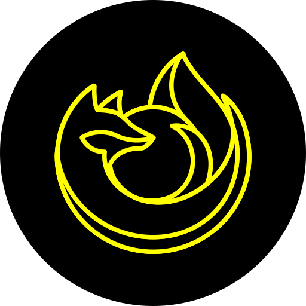

<div align="center">



# 白い熊 火狐

**Firefox in pure black & yellow — on the phone and on the desktop — with extension freedom on the release channel.**

A fork of [Mozilla Firefox](https://github.com/mozilla-firefox/firefox) (release channel) with **major additions**: custom AMO extension collections unlocked on release, add-ons installable straight from a file, a fully settable black/yellow UI with external fonts, pinned extension buttons on a two-row toolbar, one-tap sync from that toolbar, whole-profile export & import — scriptable from outside the app — about:config, a line-traced fox, and a **GNU/Linux desktop build** in the same palette.

Installs **side-by-side** with stock Firefox/Beta/Nightly: app id `shiroikuma.kako` on Android, package `shiroikuma-kako` with its own `~/.mozilla/kako` profile on the desktop.

**📥 Latest release: [`153.0.4+019`](https://github.com/ShiroiKuma0/shiroikuma-kako/releases/latest)** — [all releases & downloads »](https://github.com/ShiroiKuma0/shiroikuma-kako/releases)

</div>

---

## 🧩 Extension freedom on the release channel
Stock Fenix locks custom AMO add-on collections behind Nightly. This fork opens those channel gates on release: point the browser at any AMO collection and install everything in it — collection extensions are AMO-signed, so release signing enforcement never objects. `about:config` and the full secret-settings menu (five taps on the About logo) are unlocked too.

Extensions also install **straight from a file**. A collection can only hold add-ons published and reviewed on AMO, which locks out anything personal; the add-ons screen here takes an `.xpi` off the device instead, so an extension signed for self-distribution — private, unlisted, unreviewed — installs on the phone like any other. The desktop build goes further and needs no signature at all, so a modified add-on can be tested unsigned and only signed when it ships.

---

## 🖥 The same browser on the desktop
A GNU/Linux `amd64` build, packaged as a `.deb` and wearing the same pure black and `#FFFF00`. Chrome, popups, sidebar and the New Tab page are themed by a built-in theme, in-content dialogs and preferences by a globally registered stylesheet, and the window itself is traced with a yellow frame that dims when it loses focus — 火狐 draws its own titlebar, so no window manager will do it for you. Add-on signature enforcement is switched off in the build, which is what makes a self-modified extension installable without a round trip through AMO. It installs alongside stock Firefox with its own package name, its own `/opt` prefix and its own profile, and shares this repository, this version number and this icon with the phone.

---

## 🖤💛 The 白い熊 火狐 UI
A dedicated settings page (pinned at the top of Settings, or long-press the menu button) themes the whole browser from user-settable color slots — seeded pure black `#000000` / pure yellow `#FFFF00` — with live Compose restyling, external ttf/otf font import (family, weight, 70–160% size scale), and 0.5 dp-stepped border thickness sliders. Chrome is traced Nightly-style: outlined address pill, bordered tabs and menu cards, kako-framed alert dialogs, true-black windows.

---

## 💾 Export & import the whole profile
Pick a backup directory once; the page then shows the newest export in it every time you open it. One panel exports — or restores — the browser by category: the 白い熊 UI theme, imported fonts, **every installed extension** (re-installed from AMO on restore, with its enabled and private-browsing state, the pinned toolbar order, and your custom collection), Firefox's own settings, bookmarks, saved passwords, credit cards and addresses. The archive is a plain ZIP of readable JSON — no databases, no opaque blobs — so it stays inspectable and portable. Credentials necessarily travel as plaintext inside it, which the panel says out loud; treat the file like the passwords it holds.

---

## 🤖 Backups that another app can trigger
The same export answers a token-gated broadcast, so an automation app can back the browser up headlessly — no Activity, no tapping — and be told the exact path, byte count and category count of the ZIP it just wrote, with live progress reported as real counts (`区分 3/8 — Fonts`) rather than a percentage. The enumeration it answers says which items start ticked, so the caller's picker opens on the browser's own answer instead of guessing one. A running export can be **stopped from outside**: the cancel unwinds it at the next category boundary and takes the half-written archive with it, leaving the backup directory exactly as it was found. Nothing is reachable until the switch inside Export / Import is turned on, and the shared secret behind it never travels inside a backup.

---

## 📌 Pinned extensions & the two-row toolbar
Any extension with a browser action can be pinned to the toolbar from its settings screen, desktop-style — with its real multicolor icon, an icon-size slider, long-press reordering, and a drag-to-reorder dialog. A toggleable two-row layout keeps navigation and the address pill on top and moves new tab, pinned extensions, manage-extensions, tab counter, the account button and the menu to their own row beneath.

---

## 🔄 Sync now, one tap away
Your Mozilla-account avatar sits on the toolbar, left of the menu, and a tap on it syncs — where stock buries the same action three taps deep in the menu. The button is also the receipt: it wears a sync glyph while the run is in flight, then flashes a checkmark and a snackbar when it lands, or a warning when it fails. Only syncs you started this way announce themselves; the ones the browser runs on its own stay quiet. Long-press the same button for the account itself — settings when signed in, re-authentication for a session that broke, sign-in when signed out — so the button is never a dead end.

---

## 📄 Local HTML files open in the browser
Tap a saved page in a file manager and 火狐 is in the "open with" list — and actually renders it. Stock Fenix claims `text/html` only for `http(s)` URLs, and its engine reads `content://` for PDFs and nothing else, so a local `.html` file finds no handler at all. Both gates are opened here. The document still reaches the engine through the `content://` URI the file manager granted, so a caller has to hold the file rather than merely name a path.

---

## 🦊 The line-traced fox
The icon is the Nightly fox redrawn as yellow line art on black, from one master SVG in `tools/kako/icon/` — rendered into Android's adaptive and legacy mipmaps, and into the desktop branding and hicolor icon set. The two geometries differ on purpose: Android masks and crops adaptive icons, so the phone keeps its safe-zone padding, while the desktop icon is full-bleed and transparent so the panel shows through exactly as it does for stock.

---

## Built on Mozilla Firefox
A fork of [mozilla-firefox/firefox](https://github.com/mozilla-firefox/firefox) tracking the **release** channel tag-to-tag (app id `shiroikuma.kako`, so it coexists with the official builds). All credit to Mozilla for the browser itself; the code remains under the [Mozilla Public License 2.0](LICENSE).

Branch model: `release` is a byte-identical upstream mirror; **`custom`** carries every fork commit, rebased onto each adopted `FIREFOX_*_RELEASE` tag.

## Building

Both products build from this one tree; the mozconfig picks which, and each keeps its own objdir.

### Desktop (GNU/Linux amd64 → `.deb`)

A full build, not an artifact one. `mach bootstrap` cannot help here — on Linux it installs almost nothing and every real toolchain comes from a taskcluster index lookup that will not resolve from a release-tag checkout carrying its own commits — so it builds against the distro toolchain:

```bash
sudo apt install clang-20 libclang-20-dev lld-20 libstdc++-14-dev \
  libdbus-glib-1-dev libx11-xcb-dev libfontconfig1-dev libfreetype6-dev \
  wasi-libc libclang-rt-20-dev-wasm32 libc++-20-dev-wasm32 libc++abi-20-dev-wasm32
cargo install cbindgen

export MOZCONFIG=$PWD/tools/kako/mozconfig-desktop
./mach build && ./mach package
tools/kako/deb/build-deb.sh          # → ~/tmp/shiroikuma-kako_<version>_amd64.deb
```

`libstdc++-14-dev` is not a typo: clang-20 selects the highest GCC it finds, so without it every C++ header lookup fails even though g++ 13 is the system compiler. The four wasm packages exist solely to keep RLBox sandboxing of graphite/ogg/hunspell/expat enabled.

### Android (arm64-v8a → `.apk`)

Artifact build (prebuilt GeckoView engine; only Kotlin/Java compiles locally):

```bash
git clone --branch custom git@github.com:ShiroiKuma0/shiroikuma-kako.git
cd shiroikuma-kako
./mach bootstrap          # choose "GeckoView/Firefox for Android Artifact Mode"

export MOZCONFIG=$PWD/tools/kako/mozconfig
./mach build
./mach gradle fenix:assembleRelease
# APK: objdir-kako/gradle/build/mobile/android/fenix/app/outputs/apk/release/fenix-arm64-v8a-release.apk
# then zipalign + apksigner with your own keystore
```
